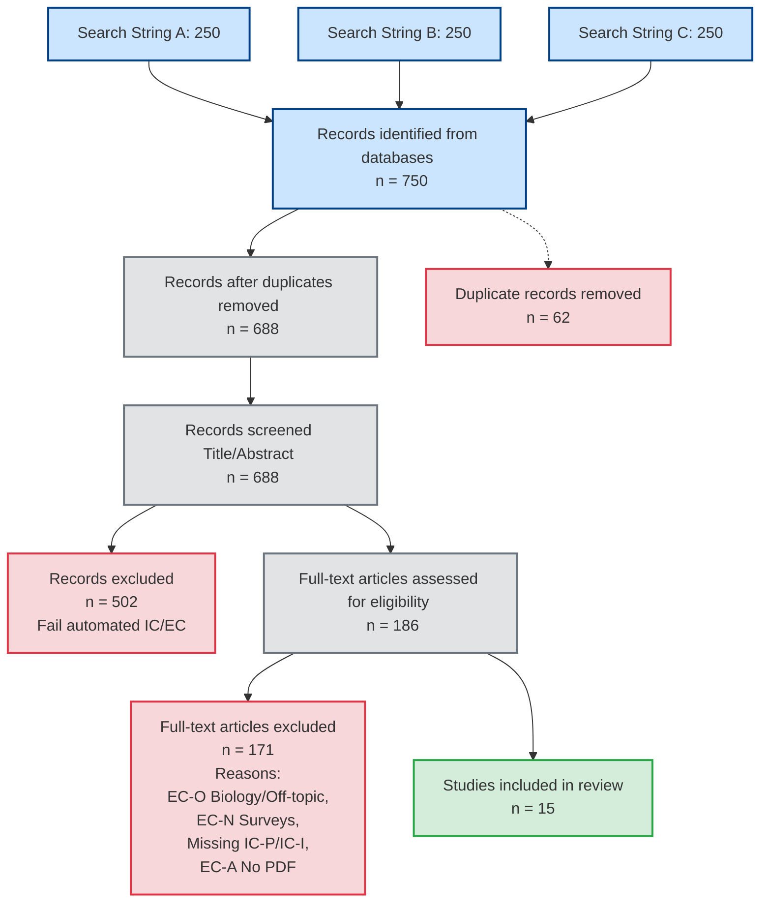

# PRISMA Flow Diagram - AI-guided Mutant Selection

Dưới đây là thống kê quy trình lọc bài báo (SLR) theo đúng chuẩn PRISMA (Preferred Reporting Items for Systematic Reviews and Meta-Analyses), phản ánh chính xác dữ liệu của nhóm:

## 1. Dữ liệu tổng quan
- **Identification (Thu thập dữ liệu):** 750 bài
- **Duplicates removed (Loại bỏ trùng lặp):** 62 bài
- **Screening V1 (Lọc Tiêu đề & Tóm tắt):** 688 bài
- **Excluded V1 (Bị loại ở V1):** 502 bài
- **Eligibility V2 (Lọc Toàn văn - Full-text):** 186 bài
- **Excluded V2 (Bị loại ở V2):** 171 bài
- **Included (Cuối cùng được chọn):** 15 bài

---

## 2. Sơ đồ PRISMA (Mermaid)
Bạn có thể copy đoạn code dưới đây vào các trình vẽ Markdown/Mermaid (như Obsidian, GitHub, hoặc Notion) để tự động tạo sơ đồ:

---

## 3. Chi tiết nguyên nhân loại trừ ở Vòng 2 (171 bài bị loại)
- **EC-O**: Sai chủ đề (chủ yếu là bài viết Sinh học/Y khoa về gen, protein hoặc Tối ưu hóa trình biên dịch).
- **EC-N**: Là các bài Survey, Systematic Literature Review, hoặc không có thực nghiệm đánh giá.
- **Fail IC-P / IC-I**: Không có đủ keyword hoặc phương pháp về Kiểm thử đột biến (Mutation Testing) và Học máy/AI.
- **EC-A**: Không thể tải hoặc trích xuất được PDF toàn văn (chỉ có Abstract).
