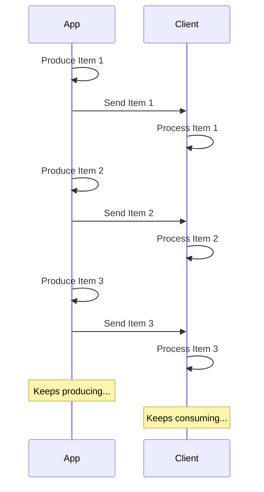

## What is a Stream? { #what-is-a-stream }

"**Streaming**" data means that your app will start sending data items to the client without waiting for the entire sequence of items to be ready.

So, it will send the first item, the client will receive and start processing it, and you might still be producing the next item.

It could even be an infinite stream, where you keep sending data.